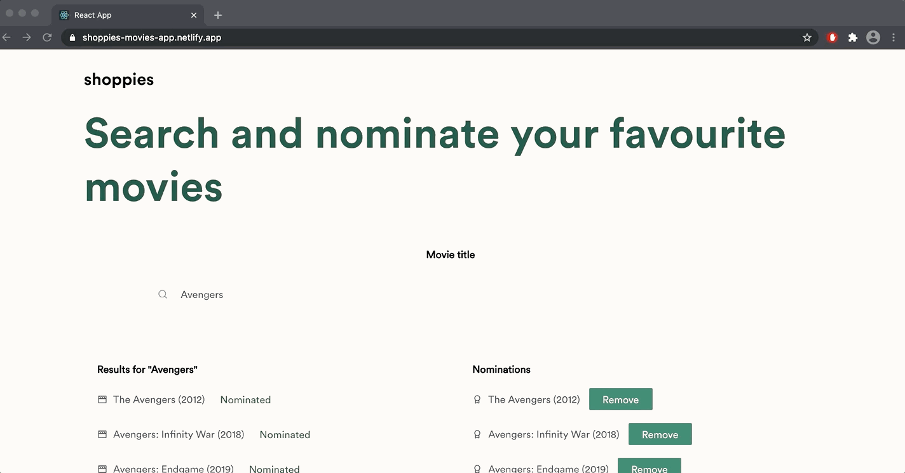

# Shoppies 

The repository is a web application that allows users to search and nominate up to five movies. The web application was built using ReactJS and the movie data was acquired from OMDb API. The link to the web application is [here](https://shoppies-movies-app.netlify.app/). 

## Preview deploy 


## Installation instructions 
1. Clone and enter this respository.  
```
git clone https://github.com/EdwardKHKim/shoppies-movies-app.git
cd shoppies-movies-app
```
2. Install all dependencies and launch live server. 
```
npm install 
npm start 
```

## Features 
### Search Movies 

### Nominate Movies 

### Banner 

### Save Data to Local Storage 

### UI/UX 

## Code Review 
